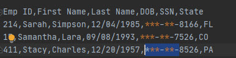

employee_data.csv holds employee records 

Python Data Cleaning:

convert and export the data to use the following format instead:

* The Name column should be split into separate First Name and Last Name columns.

* The DOB data should be re-written into MM/DD/YYYY format.

* The SSN data should be re-written such that the first five numbers are hidden from view.

* The State data should be re-written as simple two-letter abbreviations.